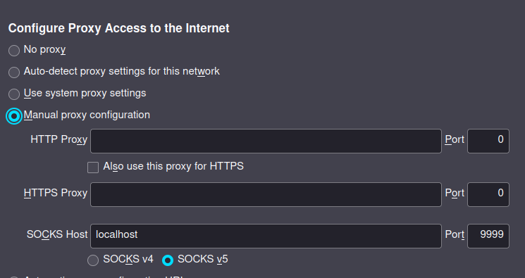

+++
title = "Advanced"
weight = 1
insert_anchor_links = "left"
+++


## Proxying through SSH
This is useful if you want to proxy your connection through some SSH server you **can** reach.
This can be used to access the internet as if you were coming from that SSH host, it can function like a makeshift VPN.

Use the following command to start a SOCKS proxy on the specified port
```sh
ssh -ND 9999 <host>
```

Now, in your web browser (Firefox shown below) go to proxy settings
(about:preferences, search "proxy") and configure as follows:



## Proxy Jumping

Sometimes, you can only access a machine through ssh, from another machine that you ssh into. 
Let's give them names: you can access machine **b** through machine **a**, 
and you can only access machine **a** from your computer.
Instead of first ssh-ing to **a** and then to **b**, you can use proxy jumping to instantly ssh into **b**.
To do so, use the following commands:

```bash
ssh -J auser@a:aport buser@b
```
You can even chain this:
```bash
ssh -J auser@a:aport,buser@b:bport,cuser@c:cport duser@d
```